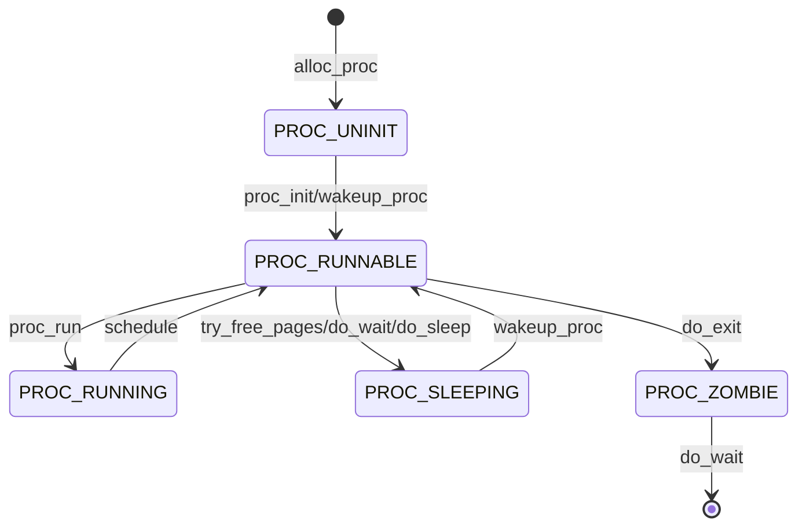

# Lab5 实验报告

## 练习 0：填写已有实验

### 题目

> 本实验依赖实验 2/3/4。请把你做的实验 2/3/4 的代码填入本实验中代码中有“LAB2”/“LAB3”/“LAB4”的注释相应部分。注意：为了能够正确执行 lab5 的测试应用程序，可能需对已完成的实验 2/3/4 的代码进行进一步改进。

### 解答

需要更新代码的部分主要在两个函数中：

1. alloc_proc 函数的更新

  在 alloc_proc 函数中，需要新增以下成员变量的初始化：

  ```c++
//LAB5新增字段
proc->wait_state = 0;       // 进程等待状态
proc->cptr = NULL;          // 子进程指针
proc->optr = NULL;          // 兄弟进程链表前驱指针
proc->yptr = NULL;          // 兄弟进程链表后继指针
  ```

  这些新增字段的作用是：

  - wait_state: 进程等待状态，标识进程是否处于等待子进程状态
  - cptr: 指向子进程的指针, 构建父子进程关系
  - optr: 指向同一父进程的上一个子进程, 构建兄弟进程关系
  - yptr: 指向同一父进程的下一个子进程, 构建兄弟进程关系

  更新后完整代码如下：

  ```c++
static struct proc_struct *
alloc_proc(void) {
    struct proc_struct *proc = kmalloc(sizeof(struct proc_struct));
    if (proc != NULL) {
    //LAB4:EXERCISE1 YOUR CODE
        proc->state = PROC_UNINIT;  // 设置进程为未初始化状态
        proc->pid = -1;             // 未初始化的的进程id为-1
        proc->runs = 0;             // 初始化时间片
        proc->kstack = 0;           // 内存栈的地址
        proc->need_resched = 0;     // 不需要调度
        proc->parent = NULL;        // 父节点设为空
        proc->mm = NULL;            // 虚拟内存为空
        memset(&(proc->context), 0, sizeof(struct context)); // 上下文的初始化
        proc->tf = NULL;            // 中断帧指针置为空
        proc->cr3 = boot_cr3;       // 页目录设为内核页目录表的基址
        proc->flags = 0;            // 标志位
        memset(proc->name, 0, PROC_NAME_LEN); // 进程名初始化为空
     //LAB5 YOUR CODE : (update LAB4 steps)
        proc->wait_state = 0;
        proc->cptr = NULL; // Child Pointer 表示当前进程的子进程
        proc->optr = NULL; // Older Sibling Pointer 表示当前进程的上一个兄弟进程
        proc->yptr = NULL; // Younger Sibling Pointer 表示当前进程的下一个兄弟进程
    }
    return proc;
}
  ```

2. do_fork 函数的更新

  在 do_fork 函数中的主要更新有：

  ```c++
// 确保当前进程不处于等待状态
assert(current->wait_state == 0);
// 使用set_links函数设置进程间的关系链接
set_links(proc);
  ```

  set_links 函数的作用是：

    1. 将新进程添加到进程链表
    2. 设置新进程与父进程的关系
    3. 设置新进程与兄弟进程的关系
    4. 更新进程计数

  更新后完整代码如下：

  ```c++
int
do_fork(uint32_t clone_flags, uintptr_t stack, struct trapframe *tf) {
    int ret = -E_NO_FREE_PROC;
    struct proc_struct *proc;
    if (nr_process >= MAX_PROCESS) {
        goto fork_out;
    }
    ret = -E_NO_MEM;
    //LAB5 YOUR CODE : (update LAB4 steps)
    if((proc = alloc_proc()) == NULL)//调用alloc_proc来分配一个proc_struct
    {
        goto fork_out;
    }
    proc->parent = current;//设置子进程的父进程为当前进程
    assert(current->wait_state == 0);//更新1：当前进程的wait_state是0
    if(setup_kstack(proc))//调用setup_kstack来为子进程分配一个内核栈
    {
        goto bad_fork_cleanup_proc;
    }
    if(copy_mm(clone_flags, proc))//调用copy_mm来根据clone_flags复制或共享当前进程的mm
    {
        goto bad_fork_cleanup_kstack;
    }
    copy_thread(proc, stack, tf);//调用copy_thread来设置子进程的trapframe和context
    bool intr_flag;
    local_intr_save(intr_flag);//关闭中断
    {
        proc->pid = get_pid();//为子进程分配一个唯一的pid
        hash_proc(proc);//将子进程加入到hash_list中
        set_links(proc);//更新5：将子进程插入到proc_list中，并设置进程之间的关系
    }
    local_intr_restore(intr_flag);//开启中断
    wakeup_proc(proc);//唤醒子进程
    ret = proc->pid;//设置返回值为子进程的pid

fork_out:
    return ret;
bad_fork_cleanup_kstack:
    put_kstack(proc);
bad_fork_cleanup_proc:
    kfree(proc);
    goto fork_out;
}
  ```

## 练习 1：加载应用程序并执行（需要编码）

### 题目

> **do_execv** 函数调用 `load_icode`（位于 kern/process/proc.c 中）来加载并解析一个处于内存中的 ELF 执行文件格式的应用程序。你需要补充 `load_icode` 的第 6 步，建立相应的用户内存空间来放置应用程序的代码段、数据段等，且要设置好 `proc_struct` 结构中的成员变量 trapframe 中的内容，确保在执行此进程后，能够从应用程序设定的起始执行地址开始执行。需设置正确的 trapframe 内容。
>
> 请在实验报告中简要说明你的设计实现过程。
>
> - 请简要描述这个用户态进程被 ucore 选择占用 CPU 执行（RUNNING 态）到具体执行应用程序第一条指令的整个经过。

### 设计实现过程

#### 理解 `load_icode` 函数的作用

`load_icode` 函数的主要功能是加载一个 ELF 格式的可执行文件到内存中，为新的用户进程设置其内存空间，包括代码段、数据段、栈等，并初始化进程的中断帧（trapframe），以便在进程调度时能够正确地从应用程序的入口地址开始执行。

#### 补充第 6 步，设置 `trapframe`

在 `load_icode` 函数的第 6 步，需要设置用户进程的 `trapframe`，确保进程切换到用户态时能够正确地执行应用程序。

具体需要设置以下内容：

- 将 `trapframe` 清零，以避免残留旧的数据。
- 设置用户栈指针 `gpr.sp`，指向用户栈的顶端 `USTACKTOP`。
- 设置程序计数器 `epc`，为可执行文件的入口地址 `elf->e_entry`。
- 设置 `sstatus` 寄存器：
	- 清除 `SSTATUS_SPP` 位，表示返回用户态而非内核态。
	- 设置 `SSTATUS_SPIE` 位，确保从中断返回后开启中断。

```c++
// (6) 设置用户环境的 trapframe
struct trapframe *tf = current->tf;
memset(tf, 0, sizeof(struct trapframe)); // 清零 trapframe
// 设置用户栈顶指针
tf->gpr.sp = USTACKTOP;
// 设置程序入口地址
tf->epc = elf->e_entry;
// 设置 sstatus 寄存器
tf->status = SSTATUS_SPIE; // 开启中断
```

### 用户态进程执行过程详解

一个用户态进程从被 uCore 选择执行（RUNNING 态）到具体执行应用程序的第一条指令，涉及以下步骤：

#### 1. 内核初始化与创建初始进程

- 在内核初始化过程中，调用 `proc_init` 函数：
	- 创建并初始化第一个内核线程 `idleproc`（空闲进程）。
	- 创建第二个内核线程 `initproc`，设置其执行函数为 `init_main`。

#### 2. 执行 `init_main` 函数

- `initproc` 进程开始执行 `init_main`：
	- 调用 `kernel_thread` 创建第三个内核线程，执行函数为 `user_main`。
	- `user_main` 线程的状态被设置为 `PROC_RUNNABLE`（可运行），等待调度。

#### 3. 进程调度与切换

- 系统调用 `schedule` 进行进程调度，选择 `user_main` 线程执行：
	- 切换到 `user_main` 进程，更新 `current` 指针。
	- 通过 `switch_to` 函数切换上下文。

#### 4. 执行 `user_main` 函数

- `user_main` 进程开始执行：
	- 调用 `kernel_execve`，尝试加载用户程序 `exit`。
	- `kernel_execve` 使用内联汇编，触发系统调用 `sys_exec`。

#### 5. 系统调用处理

- 进入 `trap` 处理函数，识别为系统调用：
	- 根据 `a7` 寄存器中的系统调用号，调用对应的 `sys_exec` 系统调用处理函数。
	- `sys_exec` 调用 `do_execve`。

#### 6. 加载用户程序

- 在 `do_execve` 中：
	- 调用 `load_icode` 加载 ELF 格式的用户程序。
	- 在 `load_icode` 中，完成以下操作：
		- 创建并初始化新的内存描述符 `mm_struct`。
		- 创建新的页目录，建立用户空间的虚拟内存。
		- 解析 ELF 文件，加载程序段到内存中，设置段的权限。
		- 初始化用户栈空间。
		- 设置 `proc_struct` 的 `mm` 和 `cr3`（页目录物理地址）。
		- 设置 `trapframe`（在第 6 步完成）：
			- 设置用户栈指针 `sp`。
			- 设置程序入口地址 `epc`。
			- 设置 `sstatus` 寄存器。

#### 7. 从内核态切换到用户态

- `load_icode` 和 `do_execve` 执行完成后，返回到 `user_main`。
- 通过 `sret` 指令从 S 态（内核态）返回到 U 态（用户态），此时 CPU 开始执行用户程序的第一条指令。

## 练习 2：父进程复制自己的内存空间给子进程（需要编码）

### 题目

> 创建子进程的函数 `do_fork` 在执行中将拷贝当前进程（即父进程）的用户内存地址空间中的合法内容到新进程中（子进程），完成内存资源的复制。具体是通过 `copy_range` 函数（位于 kern/mm/pmm.c 中）实现的，请补充 `copy_range` 的实现，确保能够正确执行。
>
> 请在实验报告中简要说明你的设计实现过程。
>
> - 如何设计实现 `Copy on Write` 机制？给出概要设计，鼓励给出详细设计。
>
> *Copy-on-write（简称 COW）的基本概念是指如果有多个使用者对一个资源 A（比如内存块）进行读操作，则每个使用者只需获得一个指向同一个资源 A 的指针，就可以该资源了。若某使用者需要对这个资源 A 进行写操作，系统会对该资源进行拷贝操作，从而使得该“写操作”使用者获得一个该资源 A 的“私有”拷贝—资源 B，可对资源 B 进行写操作。该“写操作”使用者对资源 B 的改变对于其他的使用者而言是不可见的，因为其他使用者看到的还是资源 A。*

### 解答

#### 代码实现

在 copy_range 中实现了将父进程的内存空间复制给子进程的功能。逐个内存页进行复制，首先找到父 进程的页表项，然后创建一个子进程新的页表项，设置对应的权限，然后将父进程的页表项对应的内存 页复制到子进程的页表项对应的内存页中，然后将子进程的页表项加入到子进程的页表中。

```c++
void *src_kvaddr = page2kva(page);// 获取源页面的内核虚拟地址
void *dst_kvaddr = page2kva(npage);// 获取目标页面的内核虚拟地址
memcpy(dst_kvaddr, src_kvaddr, PGSIZE);// 将源页面的内容复制到目标页面
ret = page_insert(to, npage, start, perm);// 将目标页面插入到目标页表中
```

### 如何实现 Copy on Write 机制

在实现 **Copy on Write (COW)** 机制时，主要目的是提高内存效率。当父进程创建子进程时，操作系统通常会复制父进程的内存页面给子进程，然而在 COW 机制下，父子进程最初共享相同的内存页面，只有在其中一个进程尝试修改内存时，才会进行实际的复制。这一机制有效节约了内存资源，并提高了程序的执行效率。下面是实现 COW 机制的几个关键步骤：

#### 1. 启用共享标志（share）

在前面的实验中，当我们实现 `copy_range` 函数时，父进程的内存页面会被直接复制到子进程的内存区域。然而，为了实现 COW，我们需要改为共享父子进程的内存页面。具体来说，子进程的页面将映射到父进程的内存页面上，而不是复制整个页面。这个过程的核心在于为页面启用共享标志（share）。这意味着父进程和子进程将共享相同的物理页面，直到其中一个进程对页面进行写操作。

#### 2. 设置不可写标志位

在共享父子进程的页面后，为了确保写时复制机制的正确性，我们需要将父进程和子进程的共享页面设置为只读。这样，当父进程或子进程尝试写入这些页面时，会触发一个 **页面故障 (page fault)**，从而调用缺页处理程序。此时，操作系统会创建一个新的页面，将数据从原页面复制到新页面，并将该新页面分配给发起写操作的进程。

#### 3. 修改 `do_pgfault` 函数

接下来，需要在缺页异常处理程序 `do_pgfault` 中进行修改，以处理由于写时复制触发的缺页异常。当进程试图写入共享页面时，会触发缺页异常。此时，操作系统需要检测当前的内存页是否是共享页面，并执行 COW 处理：

- 如果是共享页面，则触发写时复制操作，创建一个新的内存页，并将数据复制到新页。
- 然后，将进程的内存页更新为新创建的页面，并恢复写操作。


## 练习 3：阅读分析源代码，理解进程执行 fork/exec/wait/exit 的实现，以及系统调用的实现（不需要编码）

### 题目

> 请在实验报告中简要说明你对 fork/exec/wait/exit 函数的分析。并回答如下问题：
>
> - 请分析 fork/exec/wait/exit 的执行流程。重点关注哪些操作是在用户态完成，哪些是在内核态完成？内核态与用户态程序是如何交错执行的？内核态执行结果是如何返回给用户程序的？
> - 请给出 ucore 中一个用户态进程的执行状态生命周期图（包执行状态，执行状态之间的变换关系，以及产生变换的事件或函数调用）。（字符方式画即可）
>
> 执行：make grade。如果所显示的应用程序检测都输出 ok，则基本正确。（使用的是 qemu-1.0.1）

### 解答

#### 一、`fork`/`exec`/`wait`/`exit` 函数的执行流程分析

##### 1. `fork` 函数

**功能**：创建一个新的子进程，子进程是父进程的拷贝。

**执行流程**：

- **用户态**：
	- 进程调用 `fork()`。
	- 触发系统调用，通过软件中断或 `ecall` 指令进入内核态。

- **内核态**：
	- 进入系统调用处理函数 `syscall()`，根据系统调用号识别为 `sys_fork`。
	- 调用 `sys_fork()` 函数，进一步调用 `do_fork(0, stack, tf)`。
	- 在 `do_fork()` 中：
		- 调用 `alloc_proc()` 分配并初始化新的进程控制块 `proc_struct`。
		- 设置新进程的父进程指针 `parent` 为当前进程。
		- 调用 `setup_kstack()` 为子进程分配内核栈。
		- 调用 `copy_mm()` 根据 `clone_flags` 复制或共享内存空间（进程地址空间）。
		- 调用 `copy_thread()` 复制父进程的中断帧 `tf` 和上下文 `context`，设置子进程的内核栈等。
		- 将新进程加入进程哈希链表 `hash_list` 和进程链表 `proc_list`。
		- 调用 `wakeup_proc()` 将子进程的状态设置为 `PROC_RUNNABLE`，使其可被调度执行。
	- 返回子进程的 PID，结束系统调用，准备返回用户态。

- **用户态**：
	- 父进程和子进程分别从 `fork()` 返回：
		- 子进程返回值为 `0`。
		- 父进程返回值为子进程的 PID。

**交错执行与结果返回**：

- 内核态执行完毕后，通过更新用户栈上的返回值，将子进程的 PID 或 `0` 返回给用户态的 `fork()` 调用。
- 用户态进程通过检查 `fork()` 的返回值，区分是父进程还是子进程，从而执行不同的逻辑。

##### 2. `exec` 函数

**功能**：用一个新的程序替换当前进程的执行映像。

**执行流程**：

- **用户态**：
	- 进程调用 `exec()` 系统调用，提供新程序的路径和参数。
	- 触发系统调用，进入内核态。

- **内核态**：
	- 进入 `syscall()`，根据系统调用号识别为 `sys_exec`。
	- 调用 `sys_exec()`，进一步调用 `do_execve()`。
	- 在 `do_execve()` 中：
		- 检查提供的程序名称和参数是否合法。
		- 如果当前进程的内存管理结构 `mm` 不为空，说明占用了内存，需要清理：
			- 切换到内核页表。
			- 释放进程的内存映射、页目录表，销毁内存管理结构等。
		- 调用 `load_icode()` 加载新的可执行文件（ELF 格式）：
			- 创建新的内存管理结构 `mm`。
			- 设置新的页表 `pgdir`。
			- 解析 ELF 文件，加载程序段到内存中，建立新的内存映射。
			- 设置用户栈等。
		- 使用 `set_proc_name()` 设置进程名称。
	- 系统调用返回，准备恢复到用户态。

- **用户态**：
	- 由于当前进程的执行映像已被替换，新的程序从入口点开始执行。

**交错执行与结果返回**：

- 内核态完成加载新程序后，通过设置进程的中断帧 `tf`，确保返回用户态时，从新程序的入口地址开始执行。

##### 3. `wait` 函数

**功能**：等待一个子进程结束，并回收其资源。

**执行流程**：

- **用户态**：
	- 进程调用 `wait()` 或 `waitpid()`，等待子进程退出。
	- 触发系统调用，进入内核态。

- **内核态**：
	- 进入 `syscall()`，根据系统调用号识别为 `sys_wait`。
	- 调用 `sys_wait()`，进一步调用 `do_wait()`。
	- 在 `do_wait()` 中：
		- 检查提供的等待状态指针是否合法。
		- 遍历当前进程的子进程列表，查找指定 PID 的子进程（若 PID 为 -1，则查找任意子进程）。
		- 如果找到子进程：
			- 如果子进程已退出（状态为 `PROC_ZOMBIE`）：
				- 获取子进程的退出代码。
				- 清理子进程的资源（内核栈、进程控制块等）。
				- 从进程链表和哈希链表中移除子进程。
				- 返回子进程的 PID。
			- 如果子进程尚未退出：
				- 将当前进程的状态设置为 `PROC_SLEEPING`，等待状态设置为 `WT_CHILD`。
				- 调用 `schedule()` 进行调度切换，等待子进程退出后被唤醒。
		- 如果未找到子进程，返回错误码。
	- 系统调用返回，准备恢复到用户态。

- **用户态**：
	- `wait()` 返回子进程的 PID，或者错误码。

**交错执行与结果返回**：

- 当子进程退出后，会唤醒等待的父进程。
- 内核态通过更新 `wait()` 调用的返回值和退出状态，将结果传递给用户态。

##### 4. `exit` 函数

**功能**：终止当前进程，释放资源。

**执行流程**：

- **用户态**：
	- 进程调用 `exit()`，提供退出状态码。
	- 触发系统调用，进入内核态。

- **内核态**：
	- 进入 `syscall()`，根据系统调用号识别为 `sys_exit`。
	- 调用 `sys_exit()`，进一步调用 `do_exit()`。
	- 在 `do_exit()` 中：
		- 检查当前进程是否为关键进程（如 `idleproc`、`initproc`），若是则触发错误。
		- 获取进程的内存管理结构 `mm`，如果引用计数为 1，说明没有其他线程共享：
			- 清理内存映射，释放页目录表，销毁内存管理结构。
		- 将当前进程的状态设置为 `PROC_ZOMBIE`，表示已退出但尚未被回收。
		- 唤醒等待该进程退出的父进程（如果父进程在等待）。
		- 将当前进程的所有子进程重新挂载到 `initproc`（孤儿进程收养）。
		- 调用 `schedule()` 选择新的可运行进程，进行任务切换。
	- 系统调用结束，不再返回用户态。

- **用户态**：
	- 进程已退出，不再执行指令。

**交错执行与结果返回**：

- 内核态完成进程的退出处理，没有返回用户态。
- 通过唤醒等待的父进程，通知其子进程已退出。

#### 二、用户态与内核态的交错执行及结果返回

- **系统调用切换**：用户态通过触发系统调用（如 `int` 指令、`ecall` 指令）进入内核态。在内核态完成系统调用的处理后，再返回用户态。
- **结果传递**：内核态通过修改用户栈上的返回值，或者通过寄存器，将执行结果传递回用户态。
- **进程调度**：在某些系统调用（如 `wait`、`exit`）中，可能引起进程状态的改变（如阻塞、退出），进而触发进程调度。内核态通过保存和恢复进程的上下文，实现不同进程在用户态的交替执行。

#### 三、uCore 中用户态进程的执行状态生命周期图



## 扩展练习 Challenge 1

### 题目

> 实现 Copy on Write （COW）机制
>
> 给出实现源码, 测试用例和设计报告（包括在 cow 情况下的各种状态转换（类似有限状态自动机）的说明）。
>
> 这个扩展练习涉及到本实验和上一个实验“虚拟内存管理”。在 ucore 操作系统中，当一个用户父进程创建自己的子进程时，父进程会把其申请的用户空间设置为只读，子进程可共享父进程占用的用户内存空间中的页面（这就是一个共享的资源）。当其中任何一个进程修改此用户内存空间中的某页面时，ucore 会通过 page fault 异常获知该操作，并完成拷贝内存页面，使得两个进程都有各自的内存页面。这样一个进程所做的修改不会被另外一个进程可见了。请在 ucore 中实现这样的 COW 机制。
>
> 由于 COW 实现比较复杂，容易引入 bug，请参考 <https://dirtycow.ninja/> 看看能否在 ucore 的 COW 实现中模拟这个错误和解决方案。需要有解释。
>
> 这是一个 big challenge.

### 分析

### 解答


## 扩展练习 Challenge 2

### 题目

> 说明该用户程序是何时被预先加载到内存中的？与我们常用操作系统的加载有何区别，原因是什么？

### 分析

查看Lab5的Makefile文件我们可以知道，当编译的时候会把用户程序编译到我们的内核镜像里。

### 解答

在本次实验中，由于文件系统尚未实现，用户的二进制程序并没有像传统操作系统那样通过硬盘加载，而是直接与内核一起编译。也就是说，二进制程序被嵌入到内核镜像中，并在内核启动时一同加载到内存中。这样，程序的二进制文件实际上被存储在内存的一块特定区域内，确保在系统启动时即可执行。

#### 常见操作系统的加载流程

在常见的操作系统中，加载一个用户程序的流程通常如下：

1. **定位程序文件**：操作系统首先根据指定的路径定位到用户程序所在的文件，获取文件内容。
2. **解析程序头部**：操作系统解析二进制文件的头部，识别程序的各个段（如代码段、数据段等）以及程序的入口点。这一步骤会确保操作系统知道如何正确地加载程序，并且如何将其各个部分放置在内存中。
3. **分配内存空间**：操作系统为程序分配适当的内存空间，将程序的各个段（代码段、数据段、堆栈等）加载到内存中。通常，程序的段是根据程序的头部信息来确定的。
4. **地址重定位**：由于程序的加载地址可能与其编译时指定的地址不同，操作系统需要对程序进行地址重定位。通过这个过程，程序内部的指针、变量等将被调整为正确的内存地址，确保程序能够正常访问它的数据和代码。
5. **执行程序**：一旦程序加载完成并进行必要的地址重定位，操作系统将控制权转交给程序的入口点，程序开始执行。

#### 本次实验中的特殊情况

与常规操作系统的加载过程不同，本次实验中的用户程序在内核启动时就被加载到内存中，而非等到程序需要执行时再加载。这是因为实验环境中尚未实现文件系统功能，无法从磁盘加载可执行文件。因此，为了能够执行用户程序，我们将其直接嵌入到内核镜像中，并在内核启动时一并加载到内存中。

具体而言，在实验中，用户程序被编译为二进制形式，并与内核代码一起链接。内核启动时，程序的二进制文件就被载入内存，并且被安排在内存的一块指定区域。这种方式虽然避免了文件系统的依赖，但也使得程序只能在内核启动时加载，并且无法像常规操作系统那样灵活地进行文件操作或加载不同的程序。
